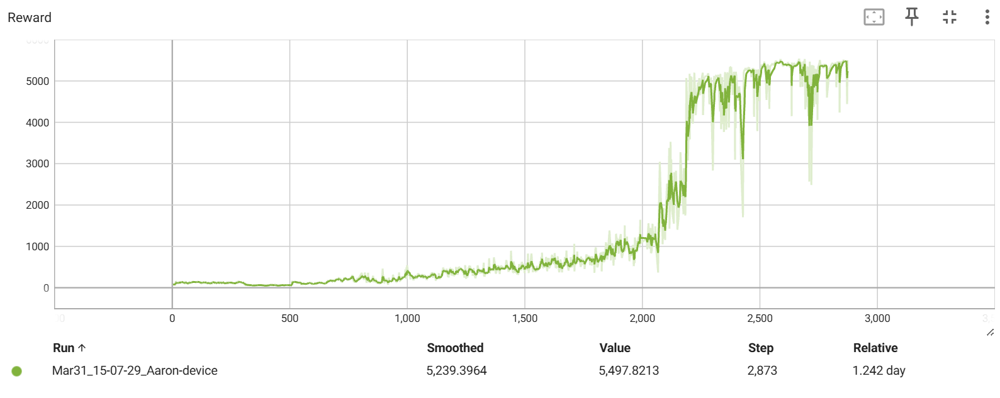

# My humanoid env training 
5500+ average reward TD3 policy trained for 7M+ timesteps.

The reward curve is:

And the walking demo video is:
<iframe width="560" height="315" src="https://youtu.be/1TzFjT7Dn9g" frameborder="0" allowfullscreen></iframe>
